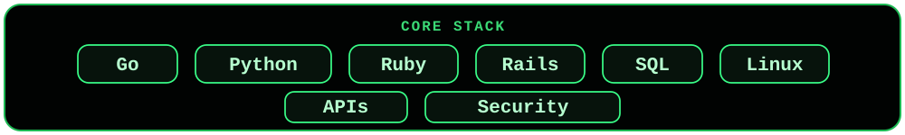
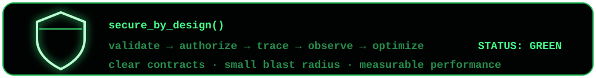

<div align="center">



<br/>


</div>

---

```bash
sreedeep@github:~$ whoami
```

```txt
Lead Software Architect with 15+ years of experience building
backend and distributed systems for enterprise environments.
```

---

## 🟢 Signal

```txt
focus       : backend systems · distributed platforms · security analytics
strength    : architecture · technical leadership · product engineering
stack       : Go · Ruby · Rails · SQL · Linux · APIs
mindset     : secure design · clear boundaries · measurable performance
```

---

## 🔐 Security + Backend DNA

```txt
[ architect ]  system design · service boundaries · technical trade-offs
[ builder   ]  APIs · data models · backend services · automation
[ security  ]  compliance · certificates · trust · secure deployment
[ scale     ]  observable systems · predictable performance · maintainability
```

---

## 🧬 Core Stack

<p align="center">
  
</p>

---

## 🚀 Public Builds

| Repository | Signal |
|---|---|
| [`gromext`](https://github.com/sreedeepkumar-mathu/gromext) | GORM extension for database-agnostic JSON operations |
| [`bfnow-storage`](https://github.com/sreedeepkumar-mathu/bfnow-storage) | Go-based backend storage work |

---

## 🧠 Innovation Log

```txt
3x patent inventor

areas:
  → post-quantum cryptographic asset validation
  → distributed ledger-based attestation
  → local snapshot-based OS update testing
```

---

<div align="center">



<br/>

### `simple systems · secure boundaries · clean architecture · measurable performance`

</div>
